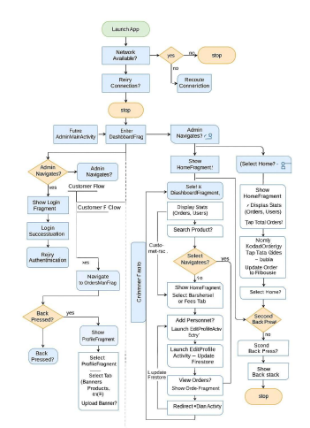
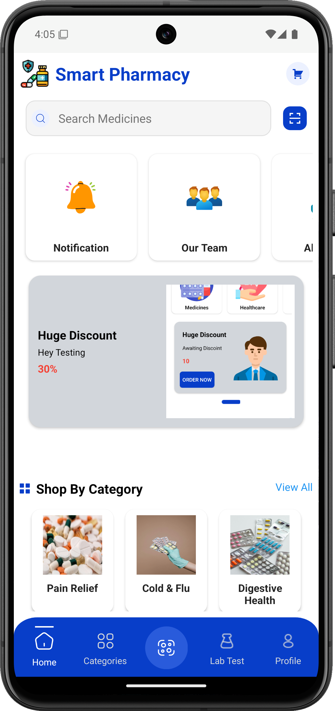
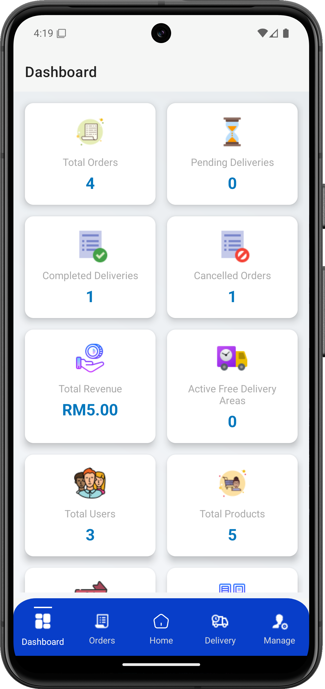
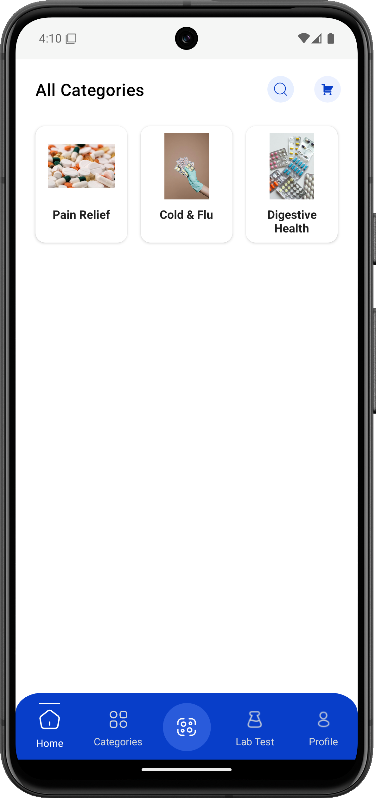
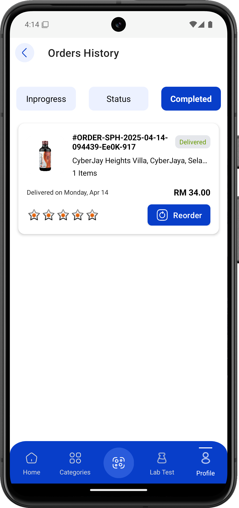
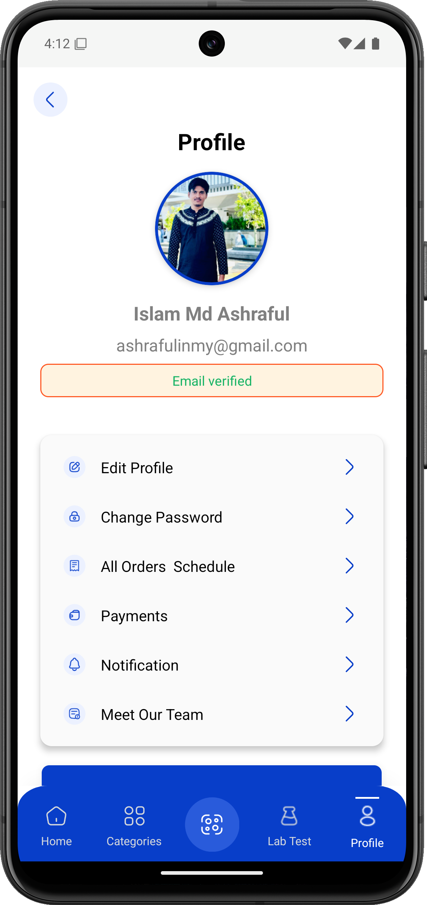

# 💊 Smart Pharmacy — Scan. Verify. Order. Deliver.


[](#)
[](#)
[](#)
[](#)
[](#)

> ✨ **Smart Pharmacy** is a full-featured Android application built for real-world healthcare challenges. From **QR code-based medicine verification** to **admin-controlled inventory**, it's designed for both urban cities and rural communities. Scalable. Offline-ready. Secure.  

---

## 🎯 Project Vision

🔬 In many regions of Malaysia and Southeast Asia, access to **authentic medicine** and timely health services is still limited. Rural areas face issues like **fake drugs**, **poor connectivity**, and **manual record keeping**.

**Smart Pharmacy** solves these problems with:
- 📱 A mobile-first, offline-capable app
- 📦 Instant **scan-to-medicine** verification with 96% accuracy
- 🛒 Seamless shopping for medications and **lab test bookings**
- 🔐 Admin dashboards for full backend control
- 🚚 Real-time order tracking and delivery coordination
- 🤝 Scalable backend for regional expansion

> 🚀 Built to modernize pharmacies and clinics in both urban & underserved areas.

---

## 📲 App Features

### 👥 For Customers
- 🔍 **Scan Medicine by QR**: Detects and verifies medicine in 0.8s using ZXing and Firestore  
- 🧪 **Lab Test Booking**: Book dengue kits, COVID tests, and more  
- 🛒 **Product Catalog**: View meds by category, name, or search bar (with debounce)  
- 🔐 **Login with Email, Google, or Phone (+60)** using Firebase Auth  
- 🚚 **Order Tracking**: Track delivery status, reorder, and rate  
- 🔔 **Push Notifications**: Live updates on delivery, tests, and promotions  
- 🌐 **Offline Access**: Caches scanned results for low-connectivity users  

### 🧑‍💼 For Admins
- 📊 **Dashboard**: Monitor orders, revenue, active users  
- 🧾 **Inventory Manager**: Add/edit products, categories, banners, and coupons  
- 👷 **Delivery System**: Assign riders, update delivery status, track routes  
- 🎯 **User Roles**: Role-based access for admin, pharmacist, delivery staff  
- 📁 **Firestore + Realtime DB** powered backend  

---

## ⚙️ Technical Overview

| Layer             | Tools & Technologies                             |
|------------------|---------------------------------------------------|
| 🔧 Language       | Java                                               |
| 🧱 Architecture   | MVVM + Repository Pattern                         |
| ☁️ Backend        | Firebase (Firestore, Auth, Storage, Realtime DB) |
| 📷 QR Scanner     | ZXing (v3.5.2)                                    |
| 🖼 Image Loading  | Glide                                             |
| 📶 Offline Cache  | SharedPreferences                                 |
| 🧩 UI Framework   | Material Design 3                                 |
| 🚀 Target Android | Android 11 to Android 14                          |

---

## 🏗️ System Architecture

Smart Pharmacy follows a **modular MVVM structure** and a **client-server architecture**, enabling maintainability and scaling.

## 🧩 Flowchart & System Diagram
<p align="center">  <br/><em>📌 Logical flow of login, medicine scan, order, and delivery</em> </p> <p align="center">  <br/><em>🔧 Client-Server Architecture + Firebase Backend</em> </p>

### 📱 Client (App Modules)
- **Activities**: `Login`, `Signup`, `Splash`, `OtpVerification`, `EditProfile`, `Main`
- **Fragments**: `Home`, `Cart`, `Scanner`, `Orders`, `Tracking`, `LabTests`, `Checkout`
- **Admin Staff**: `AdminMainActivity`, `DashboardFragment`, `OrdersManFragment`, `ManagementFragment`, `DeliveryFragment`
- **Adapters**: `CartAdapter`, `CategoryGridAdapter`, `ProductAdapter`, `TeamAdapter`
- **Models**: `User`, `Product`, `Order`, `Coupon`, `Tracking`, `LabTest`
- **Utils**: `AuthUtils`, `LoadingSpinner`, `NetworkUtils`, `AppSignatureHelper`

### ☁️ Server (Firebase)
- 🔐 **Authentication**: Role-based login (customer, admin, delivery, pharmacist)
- 📦 **Firestore**:
  - `products/` — medicines with `qrCode`, `price`, `stock`
  - `orders/` — complete order flow
  - `users/` → `addresses/`, `payment_methods/`
  - `labTests/`, `categories/`, `banners/`, `coupons/`, `notifications/`
- 💾 **Storage**: User avatars, product images
- 🔔 **Realtime DB**: For live push notifications
- 📍 **Delivery Fees**: Calculated via postal codes in `delivery_fees/`

---

## 🔄 Core Workflows

### 🧠 Scan-to-Medicine  
Fast, offline-tolerant drug scanning engine.

```java
db.collection("products")
  .whereEqualTo("qrCode", scannedCode)
  .get()
  .addOnSuccessListener(...);
````

* ⚡ Response: \~0.8s on 4G
* 🧠 Caches last 5 scans using SharedPreferences
* ✅ Handles invalid/unknown QR gracefully

### 📦 Order Placement

1. Add to Cart
2. Checkout with address & payment
3. Firestore: Save order & items
4. Realtime DB: Push notification

### 🧑‍💼 Admin Dashboard

* Update inventory
* Approve orders
* Assign delivery staff
* Monitor revenue charts

---

## 🧪 Testing & Validation

| Test Area       | Tool / Method         | Result      |
| --------------- | --------------------- | ----------- |
| QR Scan Speed   | Real Device Test      | ✅ 0.8s scan |
| Firestore Rules | Simulated Roles       | ✅ Secure    |
| Offline Access  | Rural Simulation Mode | ✅ Passed    |
| UI Tests        | Espresso              | ✅ Passed    |
| Performance     | Oppo A53, Pixel 6     | ✅ Stable    |

---

## 📷 Screenshots

<p align="center">
  
  
  
  
  
  
  
  
</p>


---

## 📈 Roadmap

| Feature                          | Target Date    |
| -------------------------------- | -------------- |
| 🗃 Room DB for full offline mode | July 2025      |
| 🌐 Malay, Tamil, Mandarin UI     | August 2025    |
| 🤖 Gemini API (AI Suggestions)   | September 2025 |
| 💳 GrabPay, Touch 'n Go Wallets  | October 2025   |
| 📄 PDF Order Receipts            | November 2025  |

---

## 🌍 Strategic Vision

> *“We believe healthcare should be faster, safer, and smarter — no matter where you live.”*

Smart Pharmacy aims to:

* 🏥 Improve rural and urban access to verified medication
* 🌏 Expand to other ASEAN countries with language & regulation support
* 🤝 Partner with hospitals, clinics & pharmacy chains
* 🤖 Integrate AI for drug suggestions, health alerts
* ☁️ Use Azure & Firebase for hybrid, scalable cloud backend

---

## 🔐 Repository Info

* 📦 This is a **Private Repository**
* 📁 Codebase: Java + Firebase + MVVM
* 📸 Screenshots & diagrams stored in `/assets/`

---

## 📬 Contact & Demo

| Contact Type | Link                                                                   |
| ------------ | ---------------------------------------------------------------------- |
| 📧 Email     | [ashrafulwpdev@gmail.com](mailto:ashrafulwpdev@gmail.com)              |
| 🌐 Portfolio | [ashrafulislam.me](https://ashrafulislam.me)                           |
| 🔗 LinkedIn  | [Click Here](https://linkedin.com/in/ashrafulwpdev) |
| 📲 APK Build | Available upon request                                                 |

---

> 🧪*Engineered with care. Optimized for impact. Built for the future of digital health.*
